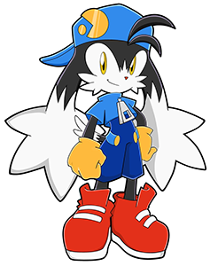

# Mio's Scripts & Tools



**This is a collection of scripts and tools intended for my partner's use!**

- Simplifying basic tasks
- Linux system maintenance
- Pre-configuring emulators for their build
- Advanced customization
- and more!

If you are viewing this otherwise, feel free to do anything you'd like with my code. Credit is given to any work not my own.

### This repo is not complete. Emulation configs will NOT yet function as intended!

## [Documentation / FAQ](docs/intro.md)

## [To-Do List](docs/todo.md)

```♡☆♡☆♡☆♡```
