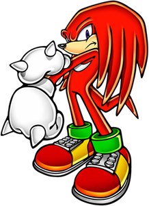

# Mio's Scripts & Tools



**This is a collection of scripts and tools intended for my partner's use!**

- Simplifying basic tasks
- Linux system maintenance
- Pre-configuring emulators for their build
- Advanced customization
- and more!

## [Documentation / FAQ](docs/intro.md)

If you are viewing this otherwise, feel free to do anything you'd like with my code. Any work not my own includes respective credit.

### This repo is not complete. Emulation configs will NOT yet function as intended!

```♡☆♡☆♡☆♡```
